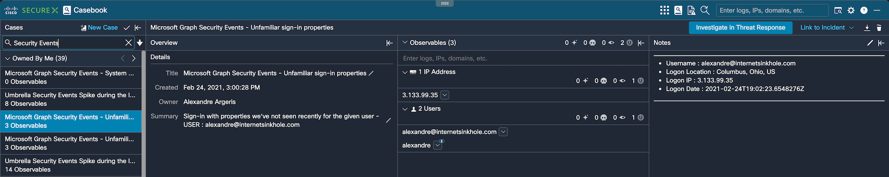
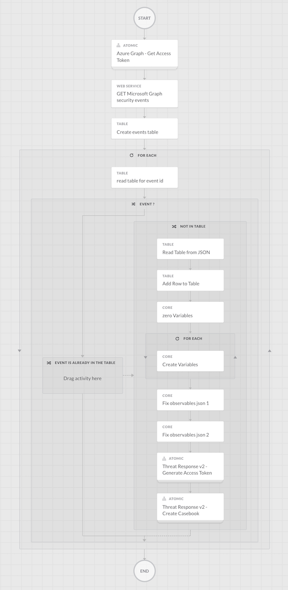

# Microsoft Graph Security Events (including MCAS) to Cisco SecureX create Casebook

Create SecureX Casebook and Sigthings based on Cisco Secure Access by Duo Auth DENIED or FRAUD logs.

Use cases : 
  - Track compromised Azure AD accounts
  - Track the potential source IP of guessing password scan in Azure AD tenant
  - Parse observables from Microsoft Graph Security Events.
  - Link Microsoft Graph Security Events (including MCAS) to other Cisco Secure Platform events

For any questions or comments/bugs please reach out to me at alexandre@argeris.net or aargeris@cisco.com

 

# Main workflows:

- Events - Cisco Secure Access Fraud _ Deny auth.json  

This workflow will fetch Duo FRAUD logs detail from a Duo Fraud Email alert and Deny logs every 1hour. Detail will be parse to create a casebook and sigthings in SecureX platform. 
  

   

# Prerequisites:
Refence for best practice and documentation https://ciscosecurity.github.io/sxo-05-security-workflows/

- Create an Admin API application in Duo and save the credentials.
    https://duo.com/docs/adminapi
    
- Copy these credentials into Cisco SecureX Orchestration variable section:

  - Admin Integration Key (iKey), Host as a string variables [duo_admin_ikey], [duo_host]
  - Admin Secret Key (sKey) as a Secure string variable [duo_admin_skey]

- From the Duo Admin portal, configure Fraud Email Alert to be send to your IMAP account

- Create (2) Azure Target based on the hostname in the Cisco SecureX Orchestration. 

  - Name: Azure_For_Access_Token
  - No account keys: True
  - HTTPS protocol, host/IP address: login.microsoftonline.com
  - Proxy: Ignore Proxy

  - Name: Azure_Grpah_API
  - No account keys: True
  - HTTPS protocol, host/IP address: graph.microsoft.com
  - Proxy: Ignore Proxy  

# Import these workflows into SecureX Orchestration as atomic workflows:
  
- Threat Response v2 - Generate Access Token.json from https://github.com/CiscoSecurity/sxo-05-security-workflows/tree/Main/Atomics
  
  This Atomic workflow action will get CTR access token.

- Threat Response v2 - Create Casebook.json from https://github.com/CiscoSecurity/sxo-05-security-workflows/tree/Main/Atomics
  
  This Atomic workflow actions will create Casebook.  
  
- Duo Admin - Get DENIED or FRAUD Auth Logs.json from this repo
  
  This Atomic workflow action will fetch Duo auth denied and fraud logs.

# References 
  https://docs.microsoft.com/en-us/graph/api/resources/alert?view=graph-rest-1.0
